[](https://docs.restate.dev)
[](https://github.com/restatedev/examples)
[](https://discord.gg/skW3AZ6uGd)
[](https://join.slack.com/t/restatecommunity/shared_invite/zt-2v9gl005c-WBpr167o5XJZI1l7HWKImA)
[](https://x.com/intent/follow?screen_name=restatedev)

# Restate - Building resilient applications made easy!

<p align="center">
  <picture>
    <source media="(prefers-color-scheme: dark)" srcset="https://restate.dev/use-cases-dark.png">
    <source media="(prefers-color-scheme: light)" srcset="https://restate.dev/use-cases-light.png">
    
  </picture>
</p>

[Restate](https://restate.dev) is the simplest way to build resilient applications.

Restate provides a distributed durable version of your everyday building blocks, letting you build a wide range of use cases:

* [Durable AI Agents](https://github.com/restatedev/ai-examples)
* [Workflows-as-Code](https://docs.restate.dev/use-cases/workflows)
* [Microservice Orchestration](https://docs.restate.dev/use-cases/microservice-orchestration)
* [Event Processing](https://docs.restate.dev/use-cases/event-processing)
* [Async Tasks](https://docs.restate.dev/use-cases/async-tasks)
* [Agents, Stateful Actors, state machines, and much more](https://github.com/restatedev/examples)

## Get started with Restate

1. 🏎 [Follow the Quickstart](https://docs.restate.dev/get_started/quickstart) to get Restate up and running within 2 minutes!
1. 💡 [The Tour of Restate](https://docs.restate.dev/get_started/tour) walks you through the most important features of Restate.

## SDKs

Restate supports the following SDKs:

* [Typescript](https://github.com/restatedev/sdk-typescript)
* [Java and Kotlin](https://github.com/restatedev/sdk-java)
* [Python](https://github.com/restatedev/sdk-python)
* [Go](https://github.com/restatedev/sdk-go)
* [Rust](https://github.com/restatedev/sdk-rust)

## Install

We offer pre-built binaries of the CLI and the server for MacOS and Linux.

Have a look at the [Quickstart](https://docs.restate.dev/get_started/quickstart) or [installation instructions in the docs](https://docs.restate.dev/develop/local_dev). 

### Install the server

Install via Homebrew:
```bash
brew install restatedev/tap/restate-server
```

Run via npx:
```bash
npx @restatedev/restate-server
```

Run via docker:
```bash
docker run --rm -p 8080:8080 -p 9070:9070 -p 9071:9071 \
    --add-host=host.docker.internal:host-gateway docker.restate.dev/restatedev/restate:latest
```

### Install the CLI

Install via Homebrew:
```bash
brew install restatedev/tap/restate
```

Install via npm:
```bash
npm install --global @restatedev/restate
```

Run via npx:
```bash
npx @restatedev/restate
```

You can also download the binaries from the [release page](https://github.com/restatedev/restate/releases) or our [download page](https://restate.dev/get-restate/).

## Community

* 🤗️ Join our online community on [Discord](https://discord.gg/skW3AZ6uGd) or [Slack](https://join.slack.com/t/restatecommunity/shared_invite/zt-2v9gl005c-WBpr167o5XJZI1l7HWKImA) for help, sharing feedback and talking to the community.
* 📖 [Check out our documentation](https://docs.restate.dev) to get started quickly!
* 📣 [Follow us on Twitter](https://twitter.com/restatedev) for staying up to date.
* 🙋 [Create a GitHub issue](https://github.com/restatedev/restate/issues) for requesting a new feature or reporting a problem.
* 🏠 [Visit our GitHub org](https://github.com/restatedev) for exploring other repositories.

## Core primitives

The basic primitives Restate offers to simplify application development are the following:

* **Reliable Execution**: Restate guarantees code runs to completion. Failures result in retries that use the [Durable Execution mechanism](https://docs.restate.dev/concepts/durable_execution) to recover partial progress and prevent re-executing completed steps.
* **Reliable Communication**: Services communicate with exactly-once semantics: whether it's [request-response, one-way messages, or scheduled tasks](https://docs.restate.dev/concepts/invocations). Restate reliably delivers messages and uses Durable Execution to ensure no losses or duplicates can happen.
* **Durable Promises and Timers**: Register Promises/Futures and timers in Restate to make them resilient to failures (e.g. sleep, webhooks, timers). Restate can recover them across failures, processes, and time.
* **Consistent State**: Implement [stateful entities](https://docs.restate.dev/concepts/services) with isolated K/V state per entity. Restate persists the K/V state updates together with the execution progress to ensure consistent state. Restate attaches the K/V state to the request on invocation, and writes it back upon completion. This is particularly efficient for FaaS deployments (stateful serverless, yay!).
* **Suspending User Code**: long-running code suspends when awaiting on a Promise/Future and resumes when that promise is resolved. This is particularly useful in combination with serverless deployments.
* **Observability & Introspection**: Restate includes a UI and CLI to inspect the [state of your application](https://docs.restate.dev/operate/introspection) across services and invocations. Restate automatically generates Open Telemetry traces for the interactions between handlers.

## Contributing

We're excited if you join the Restate community and start contributing!
Whether it is feature requests, bug reports, ideas & feedback or PRs, we appreciate any and all contributions.
We know that your time is precious and, therefore, deeply value any effort to contribute!

Check out our [development guidelines](/docs/dev/development-guidelines.md) and [tips for local development](/docs/dev/local-development.md) to get started.

## Versions

Restate follows [Semantic Versioning](https://semver.org/).

You can safely upgrade from a Restate `x.y` to `x.(y+1)` release without performing any manual data migration, as Restate performs an automatic data migration for you.

For SDK compatibility, refer to the supported version matrix in the respective READMEs:

* [Restate Java/Kotlin SDK](https://github.com/restatedev/sdk-java#versions)
* [Restate TypeScript SDK](https://github.com/restatedev/sdk-typescript#versions)
* [Restate Go SDK](https://github.com/restatedev/sdk-go#versions)
* [Restate Python SDK](https://github.com/restatedev/sdk-python#versions)
* [Restate Rust SDK](https://github.com/restatedev/sdk-rust#versions)

### Building Restate locally

In order to build Restate locally [follow the build instructions](https://github.com/restatedev/restate/blob/main/docs/dev/local-development.md#building-restate).

## Repository Architecture & Code Layout

> **Why this matters**: Restate's codebase is a *mono-repo* with ~100 crates. Understanding how they map to the architectural concepts in the [official docs](https://docs.restate.dev/references/architecture/) will make navigation and contribution painless.

### High-level view

```mermaid
graph TD
    A["External Clients"] -->|HTTP / gRPC / Kafka| I(Ingress)
    I -->|forward invocations| W(Workers)
    W -->|append events| L[Distributed Log (Bifrost)]
    L --> LS(Log Servers)
    subgraph ControlPlane
        MS(Metadata Server)
    end
    MS -- cluster metadata --> W
    MS -- log placement --> LS
    MS -- membership & roles --> I
```

* **Metadata Server** – cluster membership & configuration  → [`crates/metadata-server`](crates/metadata-server/)
* **Distributed Log (Bifrost)** – virtual-consensus log  → [`crates/bifrost`](crates/bifrost/)  
  *Log storage is provided by* **Log Servers** → [`crates/log-server`](crates/log-server/)
* **Workers / Partition-Processors** – execute user code & manage state  → [`crates/worker`](crates/worker/)
* **Ingress** – entry point for HTTP & Kafka traffic  → [`crates/ingress-http`](crates/ingress-http/) / [`crates/ingress-kafka`](crates/ingress-kafka/)

These roles are assembled into a single binary – **`restate-server`** – found in [`server/`](server/).

### Workspace map


> Tip: **use `cargo tree -p <crate>`** to explore fine-grained dependencies.

### Directory cheatsheet

| Path | What you'll find | When to look here |
|------|-----------------|-------------------|
| `server/` | Main binary; composes roles based on CLI flags & `server.yaml` | Launching Restate locally / debugging startup |
| `cli/` | Dev/ops companion CLI (`restate`) | Automating admin tasks & queries |
| `crates/core/` | Task runtime, networking, common types | Shared infra used by most crates |
| `crates/metadata-server/` | Raft-backed metadata store | Cluster bootstrap & reconfiguration |
| `crates/bifrost/` | Virtual-consensus distributed log | Control plane & clients for interacting with Bifrost |
| `crates/log-server/` | Log segment persistence (RocksDB, object-store) | Durability and replication tuning |
| `crates/worker/` | Partition processors & state machines | Business-logic execution |
| `crates/ingress-http/` | HTTP ingress | Endpoint for receiving HTTP requests |
| `crates/ingress-kafka/` | Kafka ingress connector | Kafka ingress connector |
| `crates/partition-store/` | RocksDB backed state store | State of the partition processors (materialized view of log) |

*(See `workspace-hack/` for dependency graph workarounds, and `tools/` for misc utilities.)*

### Getting around the codebase

1. **Start with the binary** – [`server/src/main.rs`](server/src/main.rs) shows how roles are wired.
2. **Follow the role** you're interested in using links above.
3. **Search logs** – Run `rg "TODO:"` to find open questions & easy issues.
4. **Run integration tests** – `cargo test -p server -- --nocapture` spins up an in-proc cluster.

### Contributing workflow

* Format & lint: `cargo fmt && cargo clippy --all-targets`.
* Feature flags follow `crate-name/feature` convention – check each `Cargo.toml`.
* Docs live under [`docs/`](docs/) – update when changing public behaviour.

---

Happy hacking! 🎉

## Deep-dive by Role

Below we drill into each major role, call out its key crates/modules, and show how they talk to each other at runtime.

### 1. Metadata Server (Control Plane)

| Location | Purpose |
|----------|---------|
| [`crates/metadata-server/src`](crates/metadata-server/src/) | Raft-backed key–value store containing **NodesConfiguration**, partition layout, log placement, and feature flags |
| [`crates/metadata-server-grpc`](crates/metadata-server-grpc/) | gRPC bindings (auto-generated & service stubs) |
| [`crates/metadata-providers/`](crates/metadata-providers/) | Client abstraction – in-process, replicated, or mock |
| [`crates/admin`](crates/admin/) | Admin API that exposes CRUD operations over metadata |

Key modules worth opening:
* [`grpc/mod.rs`](crates/metadata-server/src/grpc) – transport adaptor.
* [`raft/`](crates/metadata-server/src/raft) – Raft state-machine, snapshot logic, and membership changes.
* [`local/`](crates/metadata-server/src/local) – non-clustered single-process implementation useful for unit tests.

Practical rabbit-hole: start at 
```20:35:crates/metadata-server/src/lib.rs
pub async fn create_metadata_server_and_client(...) -> anyhow::Result<...>
```
that wires the store and returns a typed client — that's the entry-point other services use.

### 2. Distributed Log – Bifrost & Log Servers

| Location | Purpose |
|----------|---------|
| [`crates/bifrost`](crates/bifrost/) | Virtual-consensus layer: leader election, quorum writes, segment sealing |
| [`crates/log-server`](crates/log-server/) | Persists segments to RocksDB or remote object store |
| [`crates/wal-protocol`](crates/wal-protocol/) | Protobuf definition of the write-ahead log records |

Open [`crates/log-server/src/service.rs`](crates/log-server/src/service.rs) to see the **gRPC service** handling `AppendSegment` & `FetchSegment`.

### 3. Workers & Partition Processors

| Location | Purpose |
|----------|---------|
| [`crates/worker`](crates/worker/) | Top-level service spawning partition processors, snapshotter, Kafka ingress, and query engine |
| [`crates/partition-store`](crates/partition-store/) | RocksDB backed storage for invocation journals & KV state |
| [`crates/invoker-impl`](crates/invoker-impl/) | Runs user code via language-specific SDK contracts |
| [`crates/timer`](crates/timer/) & [`timer-queue`](crates/timer-queue/) | Durable timers |

Focus modules:
* `partition/partition_processor.rs` – orchestrates Durable Execution state machine.
* `subscription_controller` – coordinates push notifications to Kafka / HTTP.

### 4. Ingress Layer

| Location | Purpose |
|----------|---------|
| [`crates/ingress-http`](crates/ingress-http/) | JSON & Protobuf endpoints; path routing; auth middleware |
| [`crates/ingress-kafka`](crates/ingress-kafka/) | Streams Kafka records into invocations |

Diagram linking ingress to worker is already shown above.

### 5. CLI & Tooling

| Path | Notes |
|------|------|
| [`cli/`](cli/) | End-user CLI (Rust + clap) – interacts with Admin API & SQL engine |
| [`tools/xtask`](tools/xtask/) | Dev helper for release automation |
| [`npm/restate/`](npm/restate/) | Thin node wrapper around Rust CLI for npx installs |

---

## Runtime Request Flow (Sequence)  
*(HTTP request → durable execution → result)*

```mermaid
sequenceDiagram
    participant Client
    participant HTTP as HTTP-Ingress
    participant Worker
    participant Bifrost
    participant LogS as Log-Server
    participant Meta as Metadata

    Client->>HTTP: POST /invoke
    HTTP->>Meta: resolve partition(key)
    Meta-->>HTTP: partition = 42 leader = W1
    HTTP->>Worker: gRPC Invoke(partition 42)
    Worker->>Bifrost: Append(LogEntry)
    Bifrost->>LogS: persist segment
    Note right of Worker: Durable Execution ↩<br/>state machine resumes/parks
    Bifrost-->>Worker: Commit ack (index)
    Worker-->>HTTP: 200 OK / 202 Accepted
```



---

## Protobuf & API Surface

All cross-service contracts live under `protobuf/` directories next to their crates. To regenerate: `cargo xtask proto-gen`.

Major schema folders:
* [`crates/core/protobuf`](crates/core/protobuf/) – cluster-control RPCs
* [`service-protocol/`](service-protocol/) – public invocation wire-format (v3/v4 coexist)
* [`crates/log-server/protobuf`](crates/log-server/protobuf/) – WAL gRPC

REST & Admin OpenAPI spec is generated on the fly by [`crates/admin-rest-model`](crates/admin-rest-model/).

---

## Testing, CI & Benchmarks

1. **Unit tests** live next to code (guarded by `#[cfg(test)]`).
2. **Integration tests** in [`server/tests`](server/tests) spin up multi-node clusters; run with `cargo nextest run -p server`.
3. **Benchmarks** under [`benchmarks/`](benchmarks/) and crate-specific `benches/` folders use Criterion. Example: `cargo bench -p bifrost`.
4. **Static analysis**: `cargo clippy --workspace --all-targets --all-features` (CI gate).
5. **MIRI & Loom** are configured for concurrency bugs (`scripts/ci-*`).

---

## Building, Running & Hacking

```bash
# Build everything (optimised dev profile)
cargo build --workspace

# Start a single-node dev cluster
cargo run -p server -- start --demo

# Spawn 3-node cluster using docker-compose
cd docker && docker compose up

# SQL Introspection
restate sql "SELECT * FROM invocations LIMIT 10;"
```

*Configuration files* live in [`charts/restate-helm/templates`](charts/restate-helm/templates) and are reused by `docker/` images.

---

## How to Add a New Crate / Feature

1. Put new crate under `crates/` – keep name kebab-cased.  
2. Add to `workspace.members` in root `Cargo.toml`.  
3. If it's a role service, expose a `Service` struct implementing `run(self) -> anyhow::Result<()>`.
4. Wire it in `server/src/main.rs` behind a feature flag.
5. Add docs & an entry in this README table. ✔️

---

*(If this README feels long – skim headings first, then deep-dive where needed!)*
