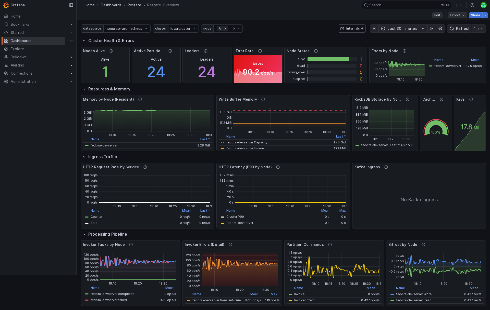
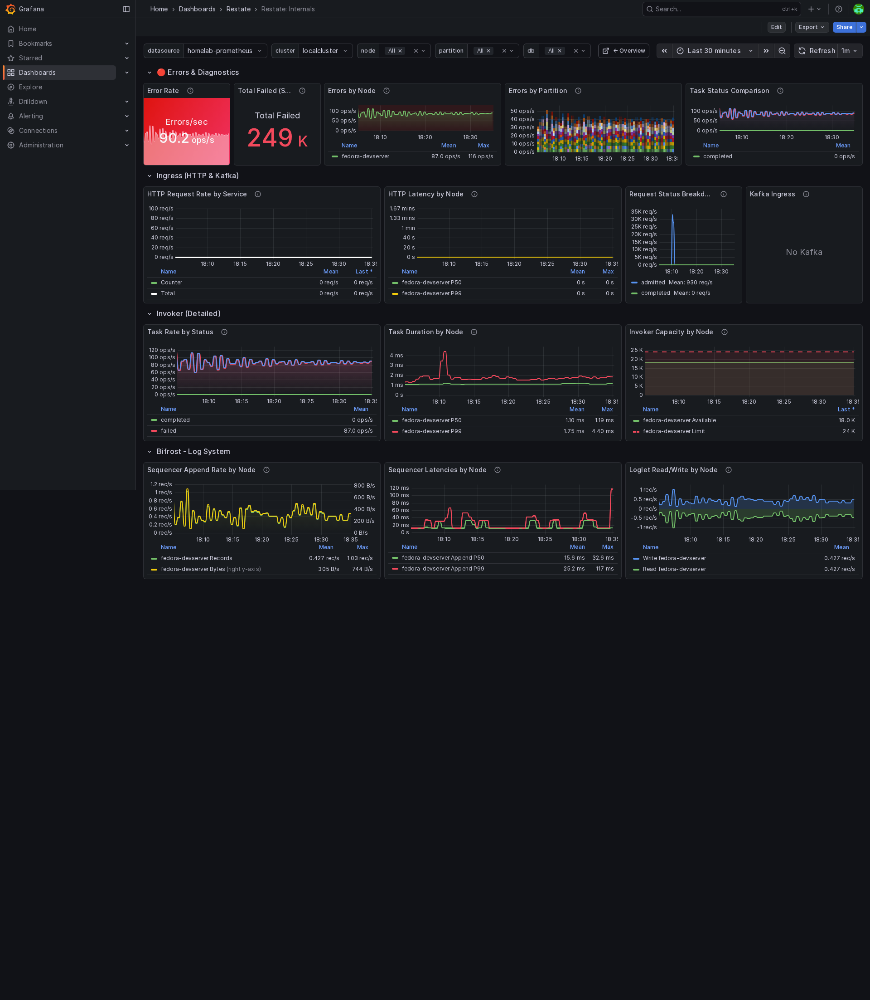

# Restate Grafana Dashboards

This directory contains Grafana dashboards for monitoring Restate Server clusters.

## Dashboards

| Dashboard | File | Description |
|-----------|------|-------------|
| **Restate: Overview** | `restate-overview.json` | High-level cluster health, resources, and throughput |
| **Restate: Internals** | `restate-internals.json` | Deep-dive into Bifrost, Invoker, RocksDB, and more |

The dashboards are linked together - click "Internals" from the Overview to drill down, or "Overview" from Internals to go back.

### Overview Dashboard



### Internals Dashboard



## Prerequisites

- **Grafana** 9.0+ (tested with 10.x)
- **Prometheus** datasource configured and scraping Restate metrics
- Restate Server exposing metrics on `/metrics` endpoint (default port 5122)

### Prometheus Scrape Configuration

```yaml
scrape_configs:
  - job_name: 'restate'
    metrics_path: '/metrics'
    static_configs:
      - targets: ['restate-server:5122']
    # For multi-node clusters, use service discovery or list all nodes:
    # - targets: ['node1:5122', 'node2:5122', 'node3:5122']
```

## Installation

1. Open Grafana and go to **Dashboards** > **Import**
2. Click **Upload JSON file** and select `restate-overview.json`
3. Select your Prometheus datasource
4. Click **Import**
5. Repeat for `restate-internals.json`

> **Important:** Import both dashboards to ensure the navigation links work correctly.

## Dashboard Variables

Both dashboards use template variables for flexibility:

| Variable | Description |
|----------|-------------|
| `datasource` | Prometheus datasource to use |
| `cluster` | Restate cluster name (from `cluster_name` label) |
| `node` | Filter by specific node(s) - defaults to all |

The Internals dashboard has additional variables:

| Variable | Description |
|----------|-------------|
| `partition` | Filter by partition ID |
| `db` | Filter by RocksDB database name |

## Dashboard Sections

### Overview Dashboard

- **Cluster Health & Errors** - Node count, error rate, errors by node
- **Resources & Memory** - JEMalloc, write buffer, RocksDB storage per node
- **Ingress Traffic** - HTTP request rate by service, latency by node, Kafka ingress
- **Processing Pipeline** - Invoker tasks, partition commands, Bifrost throughput

### Internals Dashboard

- **Errors & Diagnostics** - Error rate, errors by node/partition, task status
- **Ingress (HTTP & Kafka)** - Request rates, latencies, status breakdown
- **Invoker (Detailed)** - Task rates, duration, capacity per node
- **Bifrost - Log System** - Sequencer rates, latencies, loglet read/write
- **Partition Processor** - Command processing rate, latency, LSN lag
- **RocksDB** - Read/write ops, latencies, cache hit/miss per node
- **Metadata Server** - Operations, latencies, Raft replication

## Multi-Node Cluster Support

The dashboards are designed for multi-node clusters:

- Use the `$node` variable to filter to specific nodes or view all
- Many panels show per-node breakdown to identify problematic nodes
- Aggregated metrics (totals, averages) work correctly across the cluster

## Troubleshooting

### Links between dashboards don't work

Ensure both dashboards are imported with their original UIDs:
- Overview: `restate-overview`
- Internals: `restate-internals`

If you modified the UIDs during import, update the links in each dashboard's settings.

### No data showing

1. Verify Prometheus is scraping Restate metrics:
   ```bash
   curl http://your-restate-server:5122/metrics
   ```

2. Check the `cluster` variable has values (indicates metrics are being collected)

3. Ensure the time range is appropriate (default is last 30 minutes)

### Missing metrics

Some metrics only appear under certain conditions:
- Kafka metrics require Kafka ingress to be configured
- Partition metrics require partitions to be active
- Some latency histograms need traffic to populate

## Customization

The dashboards use stable UIDs (`restate-overview`, `restate-internals`) so you can:
- Modify panels and save changes
- Re-import updated versions with `overwrite: true`

If you need multiple independent copies (rare), change the `uid` field in the JSON before importing.

## Dashboard UIDs

| Dashboard | UID |
|-----------|-----|
| Overview | `restate-overview` |
| Internals | `restate-internals` |

These UIDs are used for linking between dashboards and must be preserved for navigation to work.
