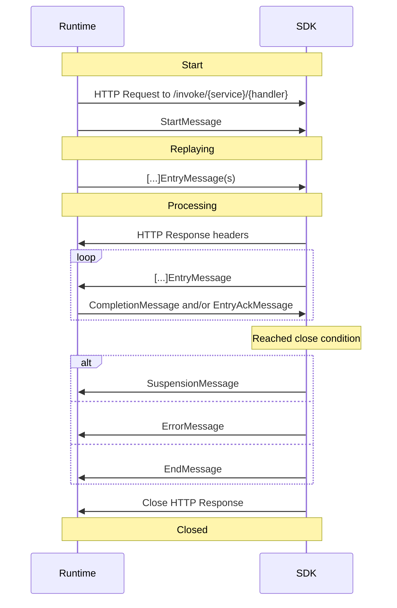

# Restate Service Invocation Protocol

The following specification describes the protocol used by Restate to invoke remote Restate services.

## Architecture

The system is composed of two actors:

- Restate Runtime
- Service deployment, which is split into:
  - SDK, which contains the implementation of the Restate Protocol
  - User business logic, which interacts with the SDK to access Restate system calls (or syscalls)

Each invocation is modeled by the protocol as a state machine, where state transitions can be caused either by user code
or by _Runtime events_.

Every state transition is logged in the _Invocation journal_, used to implement Restate's durable execution model. The
journal is also used to suspend an invocation and resume it at a later point in time. The _Invocation journal_ is
tracked both by Restate's runtime and the service deployment.

Runtime and service deployment exchange _Messages_ containing the invocation journal and runtime events through an HTTP
message stream.

## State machine and journal

Every invocation state machine begins when the stream is opened and ends when the stream is closed. In the middle,
arbitrary interaction can be performed from the Service deployment to the Runtime and vice versa via well-defined
messages.

The state machine is summarized in the following diagram:



### Replaying and Processing

Both runtime and SDKs transition the message stream through 2 states:

- _Replaying_, that is when there are journal entries to replay before continuing the execution. Described in
  [Suspension behavior](#suspension-behavior).
- _Processing_, that is after the _replaying_ state is over.

There are a couple of properties that we enforce through the design of the protocol:

- Runtime and service deployment both have their view of the journal
- The source of truth of the journal and its ordering is:
  - The runtime, when the invocation is not in _processing_ state
  - The service deployment, when the invocation is in _processing_ state
- When in _replaying_ state, the service deployment cannot create new journal entries.
- When in _processing_ state, only the service deployment can create new journal entries, picking their order.
  Consequently, it might have newer entries that the runtime is not aware of. It’s also the responsibility of the
  service deployment to make sure the runtime has the same ordered view of the journal it has.
- Only in processing state the runtime can send
  [`CompletionMessage`](#completable-journal-entries-and-completionmessage)

### Syscalls

Most Restate features, such as interaction with other services, accessing service instance state, and so on, are defined
as _Restate syscalls_ and exposed through the service protocol. The user interacts with these syscalls using the SDK
APIs, which generate _Journal Entry_ messages that will be handled by the invocation state machine.

Depending on the specific syscall, the Restate runtime generates as response either:

- A completion, that is the response to the syscall
- An ack, that is a confirmation the syscall has been persisted and **will** be executed
- Nothing

Each syscall defines a priori whether it replies with an ack or a completion, or doesn't reply at all.

## Messages

The protocol is composed by messages that are sent back and forth between runtime and the service deployment. The
protocol mandates the following messages:

- `StartMessage`
- `[..]EntryMessage`
- `CompletionMessage`
- `SuspensionMessage`
- `EntryAckMessage`
- `EndMessage`

### Message stream

In order to execute an invocation, service deployment and restate Runtime open a single stream between the runtime and
the service deployment. Given 10 concurrent invocations to a service deployment, there are 10 concurrent streams, each
of them mapping to a specific invocation.

Every unit of the stream contains a Message serialized using the
[Protobuf encoding](https://protobuf.dev/programming-guides/encoding/), using the definitions in
[`protocol.proto`](dev/restate/service/protocol.proto), prepended by a [message header](#message-header).

This stream is implemented using HTTP, and depending on the deployment environment and the HTTP version it can operate
in two modes:

- Full duplex (bidirectional) stream: Messages are sent back and forth on the same stream at the same time. This option
  is supported only when using HTTP/2.
- Request/Response stream: Messages are sent from runtime to service deployment, and later from service deployment to
  runtime. Once the service deployment starts sending messages to the runtime, the runtime cannot send messages anymore
  back to the service deployment.

A message stream MUST start with `StartMessage` and MUST end with either:

- One [`SuspensionMessage`](#suspension)
- One [`ErrorMessage`](#failures)
- One `EndMessage`

If the message stream does not end with any of these two messages, it will be considered equivalent to sending an
`ErrorMessage` with an [unknown failure](#failures).

The `EndMessage` marks the end of the invocation lifecycle, that is the end of the journal.

### Initiating the stream

When opening the stream, the HTTP request method MUST be `POST` and the request path MUST have the following format:

```
/invoke/{serviceName}/{handlerName}
```

For example:

```
/invoke/counter.Counter/Add
```

An arbitrary path MAY prepend the aforementioned path format.

In case the path format is not respected, or `serviceName` or `handlerName` is unknown, the SDK MUST close the stream
replying back with a `404` status code.

In case the invocation is accepted, `200` status code MUST be returned.

Additionally, the header `x-restate-server` MAY be sent back, with the following format:

```http request
x-restate-server: <sdk-name> / <sdk-version>
```

E.g.:

```http request
x-restate-server: restate-sdk-java/0.8.0
```

This header is used for observability purposes by the Restate observability tools.

### Message header

Each message is sent together with a message header prepending the serialized message bytes.

    0                   1                   2                   3
    0 1 2 3 4 5 6 7 8 9 0 1 2 3 4 5 6 7 8 9 0 1 2 3 4 5 6 7 8 9 0 1
    +-+-+-+-+-+-+-+-+-+-+-+-+-+-+-+-+-+-+-+-+-+-+-+-+-+-+-+-+-+-+-+-+
    |              Type             |            Reserved           |
    +-+-+-+-+-+-+-+-+-+-+-+-+-+-+-+-+-+-+-+-+-+-+-+-+-+-+-+-+-+-+-+-+
    |                             Length                            |
    +-+-+-+-+-+-+-+-+-+-+-+-+-+-+-+-+-+-+-+-+-+-+-+-+-+-+-+-+-+-+-+-+

The message header is a fixed 64-bit number containing:

- (MSB) Message type: 16 bit. The type of the message. Used to deserialize the message. The first 6 bits are used as the
  message namespace, to categorize the different message types.
- Message reserved bits: 16 bit. These bits can be used to send flags and other information, and are defined per message
  type/namespace.
- Message length: 32 bit. Length of serialized message bytes, excluding header length.

### StartMessage

The `StartMessage` carries the metadata required to bootstrap the invocation state machine, including:

- `known_entries`: The known journal length
- `state_map`: The eager state map (see [Eager state](#eager-state))

**Header**

    0                   1                   2                   3
    0 1 2 3 4 5 6 7 8 9 0 1 2 3 4 5 6 7 8 9 0 1 2 3 4 5 6 7 8 9 0 1
    +-+-+-+-+-+-+-+-+-+-+-+-+-+-+-+-+-+-+-+-+-+-+-+-+-+-+-+-+-+-+-+-+
    |             0x0000            | Reserved  |         PV        |
    +-+-+-+-+-+-+-+-+-+-+-+-+-+-+-+-+-+-+-+-+-+-+-+-+-+-+-+-+-+-+-+-+
    |                             Length                            |
    +-+-+-+-+-+-+-+-+-+-+-+-+-+-+-+-+-+-+-+-+-+-+-+-+-+-+-+-+-+-+-+-+

Flags:

- 6 bits (MSB): Reserved
- 10 bits `PV`: Protocol version. Mask: `0x0000_03FF_0000_0000`

### Entries and Completions

For each journal entry the runtime commits the entry message and executes the corresponding action atomically. The
runtime won't commit the entry, nor perform the action, if the entry is invalid. If an entry is not committed, all the
subsequent entries are not committed as well.

Entries can be:

- Completable or not: These represent actions the runtime will perform, and for which consequently provide a completion
  value. All these entries have a `result` field defined in the message descriptor, defining the different variants of
  the completion value, and have a `COMPLETED` flag in the header.
- Fallible or not: These can be rejected by the runtime when trying to commit them. The failure is not recorded in the
  journal, thus the runtime will abort the stream after receiving an invalid entry from the SDK.

The type of the journal entry is intrinsic in the definition of the journal action itself.

The header format for journal entries applies both when the runtime is sending entries to the SDK during a replay, and
when the SDK sends entries to the runtime during processing.

**Headers**

    0                   1                   2                   3
    0 1 2 3 4 5 6 7 8 9 0 1 2 3 4 5 6 7 8 9 0 1 2 3 4 5 6 7 8 9 0 1
    +-+-+-+-+-+-+-+-+-+-+-+-+-+-+-+-+-+-+-+-+-+-+-+-+-+-+-+-+-+-+-+-+
    |              Type             |A|          Reserved         |C|
    +-+-+-+-+-+-+-+-+-+-+-+-+-+-+-+-+-+-+-+-+-+-+-+-+-+-+-+-+-+-+-+-+
    |                             Length                            |
    +-+-+-+-+-+-+-+-+-+-+-+-+-+-+-+-+-+-+-+-+-+-+-+-+-+-+-+-+-+-+-+-+

Flags:

- 1 bit (MSB) `A`: [`REQUIRES_ACK` flag](#acknowledgment-of-stored-entries). Mask: `0x0000_8000_0000_0000`
- 14 bits: Reserved
- 1 bit `C`: `COMPLETED` flag (only Completable journal entries). Mask: `0x0000_0001_0000_0000`

#### Completable journal entries and `CompletionMessage`

A completable journal entry at any point in time is either completed or not. After a completable journal entry is
completed, it cannot change its state back to not completed.

There are three situations where a completable journal entry can be completed:

- At creation time: when the SDK creates a completable journal entry, it can fill its `result` field and set the
  `COMPLETED` flag before sending the entry to the runtime. When replaying, the same `result` will be used.
- At suspension time: when the invocation is suspended, meaning there is no in-flight message stream, the runtime might
  internally complete a journal entry filling its `result` field.
- During the invocation processing: when the message stream is active and in [Full duplex mode](#message-stream), the
  runtime can notify a completion by sending a `CompletionMessage`.

A `CompletionMessage` holds the `result` of the JournalEntry and its `entry_index`. A `CompletionMessage` can hold all
the possible variants of a `result` field, and the SDK MUST be able to correlate the `result` field of the entry with
the `result` field of `CompletionMessage` through the `entry_index`. After the completion is notified, the SDK MUST NOT
send any additional messages related to this specific entry. On subsequent replays, the runtime automatically fills the
`result` field of this entry, without sending a subsequent `CompletionMessage`.

The runtime can send `CompletionMessage` in a different order than the one used to store journal entries. The SDK might
also not be interested in the `result` of completable journal entries, or it might be interested in the `results` in a
different order used to create the related journal entries. Usually it's the service business logic that dictates in
which `result`s the SDK is interested, and in which order.

**`CompletionMessage` Header**

    0                   1                   2                   3
    0 1 2 3 4 5 6 7 8 9 0 1 2 3 4 5 6 7 8 9 0 1 2 3 4 5 6 7 8 9 0 1
    +-+-+-+-+-+-+-+-+-+-+-+-+-+-+-+-+-+-+-+-+-+-+-+-+-+-+-+-+-+-+-+-+
    |             0x0001            |            Reserved           |
    +-+-+-+-+-+-+-+-+-+-+-+-+-+-+-+-+-+-+-+-+-+-+-+-+-+-+-+-+-+-+-+-+
    |                             Length                            |
    +-+-+-+-+-+-+-+-+-+-+-+-+-+-+-+-+-+-+-+-+-+-+-+-+-+-+-+-+-+-+-+-+

#### Acknowledgment of stored entries

If the SDK needs an acknowledgment that a journal entry, of any type, has been persisted, it can set the `REQUIRES_ACK`
flag in the header. When set, as soon as the entry is persisted, the runtime will send back a `EntryAckMessage` with the
index of the corresponding entry.

**`EntryAckMessage` Header**

    0                   1                   2                   3
    0 1 2 3 4 5 6 7 8 9 0 1 2 3 4 5 6 7 8 9 0 1 2 3 4 5 6 7 8 9 0 1
    +-+-+-+-+-+-+-+-+-+-+-+-+-+-+-+-+-+-+-+-+-+-+-+-+-+-+-+-+-+-+-+-+
    |             0x0004            |            Reserved           |
    +-+-+-+-+-+-+-+-+-+-+-+-+-+-+-+-+-+-+-+-+-+-+-+-+-+-+-+-+-+-+-+-+
    |                             Length                            |
    +-+-+-+-+-+-+-+-+-+-+-+-+-+-+-+-+-+-+-+-+-+-+-+-+-+-+-+-+-+-+-+-+

#### Entry names

Every Journal entry has a field `string name = 12`, which can be set by the SDK when recording the entry. This field is
used for observability purposes by Restate observability tools.

### Journal entries reference

The following tables describe the currently available journal entries. For more details, check the protobuf message
descriptions in [`protocol.proto`](dev/restate/service/protocol.proto).

| Message                         | Type     | Completable | Fallible | Description                                                                                                                                                      |
| ------------------------------- | -------- | ----------- | -------- | ---------------------------------------------------------------------------------------------------------------------------------------------------------------- |
| `InputEntryMessage`             | `0x0400` | No          | No       | Carries the invocation input message(s) of the invocation.                                                                                                       |
| `GetStateEntryMessage`          | `0x0800` | Yes         | No       | Get the value of a service instance state key.                                                                                                                   |
| `GetStateKeysEntryMessage`      | `0x0804` | Yes         | No       | Get all the known state keys for this service instance. Note: the completion value for this message is a protobuf of type `GetStateKeysEntryMessage.StateKeys`.  |
| `SleepEntryMessage`             | `0x0C00` | Yes         | No       | Initiate a timer that completes after the given time.                                                                                                            |
| `InvokeEntryMessage`            | `0x0C01` | Yes         | Yes      | Invoke another Restate service.                                                                                                                                  |
| `AwakeableEntryMessage`         | `0x0C03` | Yes         | No       | Arbitrary result container which can be completed from another service, given a specific id. See [Awakeable identifier](#awakeable-identifier) for more details. |
| `BackgroundInvokeEntryMessage`  | `0x0C02` | No          | Yes      | Invoke another Restate service at the given time, without waiting for the response.                                                                              |
| `CompleteAwakeableEntryMessage` | `0x0C04` | No          | Yes      | Complete an `Awakeable`, given its id. See [Awakeable identifier](#awakeable-identifier) for more details.                                                       |
| `OutputEntryMessage`            | `0x0401` | No          | No       | Carries the invocation output message(s) or terminal failure of the invocation.                                                                                  |
| `SetStateEntryMessage`          | `0x0800` | No          | No       | Set the value of a service instance state key.                                                                                                                   |
| `ClearStateEntryMessage`        | `0x0801` | No          | No       | Clear the value of a service instance state key.                                                                                                                 |
| `ClearAllStateEntryMessage`     | `0x0802` | No          | No       | Clear all the values of the service instance state.                                                                                                              |
| `SideEffectEntryMessage`        | `0x0C05` | No          | No       | Run non-deterministic user provided code and persist the result.                                                                                                 |

#### Awakeable identifier

When creating an `AwakeableEntryMessage`, the SDK MUST expose to the user code an id, required to later complete the
entry, using either `CompleteAwakeableEntryMessage` or some other mechanism provided by the runtime.

The id format is a string starts with `prom_1` concatenated with a
[Base64 URL Safe string](https://datatracker.ietf.org/doc/html/rfc4648#section-5) encoding of a byte array that
concatenates:

- `StartMessage.id`
- The index of the Awakeable entry, encoded as unsigned 32 bit integer big endian.

An example of a valid identifier would look like `prom_1NMyOAvDK2CcBjUH4Rmb7eGBp0DNNDnmsAAAAAQ`

## Suspension

As mentioned in [Replaying and processing](#replaying-and-processing), an invocation can be suspended while waiting for
some journal entries to complete. When suspended, no message stream is in-flight for the given invocation.

To suspend an invocation, the SDK MUST send a `SuspensionMessage` containing entry indexes of the journal entry results
required to continue the computation. This set MUST contain only indexes of completable journal entries that are not
completed and that have been sent to the runtime. After sending the `SuspensionMessage`, the stream MUST be closed.

The runtime will resume the invocation as soon as at least one of the given indexes is completed.

## Failures

There are a number of failures that can incur during a service invocation, including:

- Transient network failures that interrupt the message stream
- SDK bugs
- Protocol violations
- Business logic bugs
- User thrown retryable errors

To notify a failure, the SDK can either:

- Close the stream with `ErrorMessage` as last message. This message is used by the runtime for accurate reporting to
  the user.
- Close the stream without `EndMessage` or `SuspensionMessage` or `ErrorMessage`. This is equivalent to sending an
  `ErrorMessage` with unknown reason.

The runtime takes care of retrying to execute the invocation after such failures occur, following a defined set of
policies. When retrying, the previous stored journal will be reused. Moreover, the SDK MUST NOT assume that every
journal entry previously sent on the same message stream has been correctly stored.

The SDK can allow users to end/terminate invocations with an exceptional return value. This is done in a similar fashion
to the successful return value case, by generating a `OutputStreamEntry` with the `failure` variant set, sending it and
closing the stream afterward.

**`ErrorMessage` Header**

    0                   1                   2                   3
    0 1 2 3 4 5 6 7 8 9 0 1 2 3 4 5 6 7 8 9 0 1 2 3 4 5 6 7 8 9 0 1
    +-+-+-+-+-+-+-+-+-+-+-+-+-+-+-+-+-+-+-+-+-+-+-+-+-+-+-+-+-+-+-+-+
    |             0x0003            |            Reserved           |
    +-+-+-+-+-+-+-+-+-+-+-+-+-+-+-+-+-+-+-+-+-+-+-+-+-+-+-+-+-+-+-+-+
    |                             Length                            |
    +-+-+-+-+-+-+-+-+-+-+-+-+-+-+-+-+-+-+-+-+-+-+-+-+-+-+-+-+-+-+-+-+

## Optional features

The following section describes optional features SDK developers MAY implement to improve the experience and provide
additional features to the users.

### Custom entry messages

The protocol allows the SDK to register an arbitrary entry type within the journal. The type MUST be `>= 0xFC00`. The
runtime will treat this entry as any other entry, persisting it and sending it during replay in the correct order.

Custom entries MAY have the entry name field `12`, as described in [entry names](#entry-names).

The field numbers 13, 14 and 15 MUST not be used, as they're reserved for completable journal entries, as described in
[completable journal entries](#completable-journal-entries-and-completionmessage).

**Header**

    0                   1                   2                   3
    0 1 2 3 4 5 6 7 8 9 0 1 2 3 4 5 6 7 8 9 0 1 2 3 4 5 6 7 8 9 0 1
    +-+-+-+-+-+-+-+-+-+-+-+-+-+-+-+-+-+-+-+-+-+-+-+-+-+-+-+-+-+-+-+-+
    |              Type             |A|           Reserved          |
    +-+-+-+-+-+-+-+-+-+-+-+-+-+-+-+-+-+-+-+-+-+-+-+-+-+-+-+-+-+-+-+-+
    |                             Length                            |
    +-+-+-+-+-+-+-+-+-+-+-+-+-+-+-+-+-+-+-+-+-+-+-+-+-+-+-+-+-+-+-+-+

- Type MUST be `>= 0xFC00`

Flags:

- 1 bit (MSB) `A`: [`REQUIRES_ACK` flag](#acknowledgment-of-stored-entries). Mask: `0x0000_8000_0000_0000`
- 15 bits: Reserved

### Eager state

As described in [Journal entries reference](#journal-entries-reference), to get a service instance state entry, the SDK
creates a `GetStateEntryMessage` without a result, and waits for a `Completion` with the result, or alternatively
suspends and expects the `GetStateEntryMessage.result` is filled when replaying.

SDKs MAY optimize the state access operations by reading the `partial_state` and `state_map` fields within the
[`StartMessage`](#startmessage). The `state_map` field contains key-value pairs of the current state of the service
instance. When `partial_state` is set, the `state_map` is partial/incomplete, meaning there might be entries stored in
the Runtime that are not part of `state_map`. When `partial_state` is unset, the `state_map` is complete, thus if an
entry is not within the map, the SDK can assume it's not stored in the runtime either.

A possible implementation could be the following. Given a user requests a state entry with key `my-key`:

- If `my-key` is available in `state_map`, generate a `GetStateEntryMessage` with filled `result`, and return the value
  to the user
- If `my-key` is not available in `state_map`
  - If `partial_state` is unset, generate a `GetStateEntryMessage` with empty `result`, and return empty to the user
  - If `partial_state` is set, generate a `GetStateEntryMessage` without a `result`, and wait for the runtime to send a
    `Completion` back (same logic as without eager state)

In order for the aforementioned algorithm to work, set, clear and clear all state operations must be reflected on the
local `state_map` as well.
